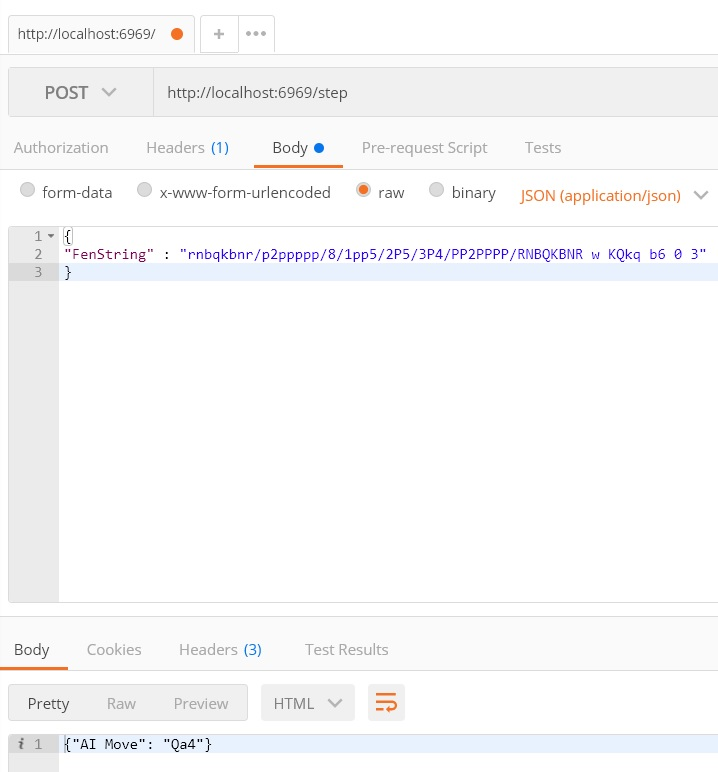

# Chess AI
HTTP POST Endpoint that response the ChessAI-s move to a given table.


Uses the Alpha-Beta algorithm to search for the best move. 


## Example Usage



## Getting started
Download the repository and install the numpy dependency:
```
git clone https://github.com/dr-chesster/ChessAI
cd ChessAI
pip install -r requirements.txt

```

Run the program and start sending POST Requests! ♟️
```
python main.py
```

### Example Moves
Moves should have the following format:
```
A2 A4
```
This will move the piece from position A2 to A4.

